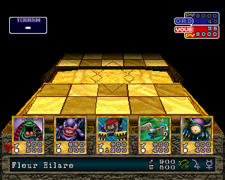
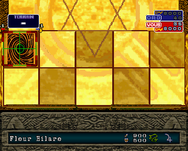

# Yu-Gi-Oh! Forbidden Memories — New Nintendo 3DS

Projet expérimental de portage/recompilation de **Yu-Gi-Oh! Forbidden Memories**
(version française **SLES-03948**) vers **New Nintendo 3DS**.

> [!IMPORTANT]
> Le port n'est pas encore jouable de bout en bout, mais le backend 3DS exécute
> désormais une partie importante du vrai jeu : boot PS1, chargements CD, rendu
> GPU logiciel, écran titre, menu principal, navigation, nouvelle partie,
> saisie/validation du nom et progression jusqu'à la première cinématique / aux
> premiers dialogues.
>
> Le verrou principal au **21 septembre 2026** est désormais la **performance** :
> le chemin actuel fonctionne mais tourne à seulement quelques FPS dans les tests
> récents. La cinématique atteinte présente également encore des défauts de rendu.

## État du projet — 21 septembre 2026

| Partie | État actuel |
| --- | --- |
| Profil PAL France / SLES-03948 | ✅ Vérifié |
| Extraction / analyse PS-X EXE | ✅ Fonctionnelle |
| Analyse Ghidra française | ✅ Résident + overlays étudiés |
| Runtime PC | ✅ Jusqu'au premier duel |
| Build natif New 3DS | ✅ ARM11 avec devkitARM/libctru |
| Code résident recompilé ARM11 | ✅ Lié dans le binaire 3DS |
| Dispatch hybride | ✅ ARM recompilé + fallback R3000A |
| BIOS / IRQ / VBlank | 🟡 Suffisants pour le chemin courant |
| CD-ROM / lecture secteurs | 🟡 Fonctionnel sur le chemin courant |
| GP0 / GP1 + rasteriseur logiciel | ✅ Rendu réel confirmé |
| DMA2 / synchronisation GPU | 🟡 Plusieurs chemins bridgés |
| GTE | 🟡 Sous-ensemble nécessaire au chemin courant |
| Pad / navigation | ✅ START + navigation/validation |
| Overlay SU.mrg | ✅ Chargé et exécuté |
| Menu principal | ✅ Visible et navigable |
| Nouvelle partie | ✅ Atteinte |
| Saisie du nom | ✅ Écriture + validation fonctionnelles |
| Première cinématique / dialogues | 🟡 Atteints, rendu encore incorrect |
| Performance | 🔴 Quelques FPS observés, hotspot à isoler |
| Audio XA / SPU | ❌ Non implémenté |
| Sauvegarde | ❌ Non implémentée |
| Test New 3DS physique | ❌ Pas encore validé |

## Dernier jalon majeur

Le problème historique du menu SU invisible a été franchi. Le backend permet
maintenant de :

1. afficher le logo Konami et l'écran titre ;
2. entrer dans le vrai menu principal ;
3. naviguer et valider une sélection ;
4. lancer une nouvelle partie ;
5. afficher la saisie du nom ;
6. saisir et valider un nom ;
7. poursuivre jusqu'à la première cinématique et aux premiers dialogues.

Révision de référence :

~~~text
912036e9355873d652790a97e160819f031724d9
UP TO FIRST CINEMATIC AND CHAT
~~~

La priorité n'est donc plus de faire apparaître le jeu, mais de rendre ce chemin
**suffisamment rapide, fidèle et robuste** pour poursuivre le portage.

Voir :
[État courant](docs/CURRENT_STATUS.md) ·
[Plan d'action](docs/ACTION_PLAN.md) ·
[Roadmap](docs/ROADMAP.md) ·
[Handoff](docs/WORK_HANDOFF.md)

## Architecture actuelle

~~~text
SLES_039.48 / disc.bin
        |
        v
   PS-X EXE + CD
        |
        v
 CPUState / RAM PS1
        |
        v
 dispatcher hybride
   |             |
 ARM11       R3000A fallback
   \             /
    v           v
      BIOS / MMIO
        |
  +-----+------+------+
  |            |      |
 IRQ/VBlank    CD    GPU/DMA
                      |
                 GP0 / GP1
                      |
               rasteriseur SW
                      |
                    VRAM
                      |
              écran supérieur
~~~

Les overlays dynamiques restent exécutables via le fallback R3000A. Cela permet
d'avancer fonctionnellement sans recompiler immédiatement chaque routine, mais
ce fallback est désormais aussi un candidat majeur au profiling de performance.

## Performance : état actuel

Plusieurs optimisations et instruments sont déjà intégrés :

- compilation 3DS en profil release -O3 / NDEBUG ;
- reconstruction des shards générés avec le même profil release ;
- LUT RGB555 → BGR888 pour la présentation ;
- suppression du clear complet du framebuffer à chaque frame ;
- flush/swap limité à l'écran supérieur ;
- mesures séparées du temps guest, rendu, VBlank et boucle complète ;
- instrumentation VSync ;
- profiler de plages guest / hotspots.

Ces améliorations n'ont pas encore ramené le jeu à une cadence acceptable. La
prochaine étape doit mesurer précisément où part le temps CPU : fallback R3000A,
callbacks/VBlank, renderer logiciel, copie VRAM, attente GPU ou routine guest
exécutée anormalement souvent.

## Avancement PC vérifié

Le runtime PC expérimental a atteint le menu principal français, créé une
nouvelle partie et atteint le premier duel contre Simon Muran. Une carte a été
posée et un tour terminé.

  
  

Le runtime PC reste l'oracle fonctionnel pour comparer transitions, timings,
overlays et écrans attendus.

## Prototype New 3DS

Le dossier [3ds/](3ds/) contient notamment :

- lecture du BIN français MODE2/2352 depuis SD ;
- chargement du PS-X EXE à 0x80010000, entrée 0x800128CC ;
- RAM PS1 2 Mio, scratchpad et alias KSEG ;
- CPUState PSXRecomp ;
- dispatcher ARM11 + fallback R3000A ;
- HLE BIOS / MMIO / IRQ / pad ;
- lecture CD et file de requêtes asynchrones ;
- bridge GPU GP0/GP1, DMA et rasteriseur logiciel ;
- chargement/exécution des overlays ;
- présentation framebuffer 3DS optimisée ;
- diagnostics et profiling sur l'écran inférieur.

## Compiler

Prérequis : devkitPro 3ds-dev, Git, Python 3.11+ et PSXRecomp épinglé à :

~~~text
1965b2df424da03483a5370340433a862f78f103
~~~

~~~sh
git clone https://github.com/Unchiga/psxrecomp.git work/upstream-psxrecomp
git -C work/upstream-psxrecomp checkout 1965b2df424da03483a5370340433a862f78f103

export DEVKITPRO=/opt/devkitpro
export DEVKITARM=$DEVKITPRO/devkitARM
export PATH=$DEVKITARM/bin:$PATH

bash rebuild_generated_release.sh
make -C 3ds clean
make -C 3ds -j4
~~~

Le script rebuild_generated_release.sh cherche désormais automatiquement
arm-none-eabi-gcc dans les emplacements devkitPro usuels sous MSYS/Git Bash.

Sorties :

~~~text
3ds/fm-new3ds.elf
3ds/fm-new3ds.3dsx
~~~

## Disque de test

~~~text
sdmc:/3ds/fm-new3ds/disc.bin
~~~

~~~text
Version        : PAL France / SLES-03948
Format         : BIN brut MODE2/2352
Taille         : 548 427 600 octets
SHA-256        : 9ef0d0ba5e42b838bd8312ecfe4071b09c44bc08ee896f6b76f913a41fe4b835
Point d'entrée : 0x800128CC
~~~

Aucun dump du jeu ni BIOS Sony n'est distribué par ce dépôt.

## Priorités immédiates

1. profiler le chemin qui fait tomber l'exécution à quelques FPS ;
2. identifier les fonctions / plages guest les plus coûteuses ou répétées ;
3. distinguer interpréteur, code recompilé, rendu logiciel, présentation et waits ;
4. supprimer les bypass/bridges qui provoqueraient du travail répété ou un mauvais timing ;
5. retrouver une cadence suffisante pour travailler confortablement ;
6. corriger ensuite le rendu de la première cinématique ;
7. poursuivre vers les dialogues puis le premier duel sur backend 3DS.

Le plan détaillé est dans [docs/ACTION_PLAN.md](docs/ACTION_PLAN.md).

## Données du jeu et licences

**Aucun disque, BIOS PlayStation propriétaire, exécutable original ou contenu
propriétaire du jeu n'est distribué dans ce dépôt.**

Yu-Gi-Oh! et Forbidden Memories appartiennent à leurs ayants droit respectifs.
Ce projet de recherche et de portage n'est pas affilié à Konami.
