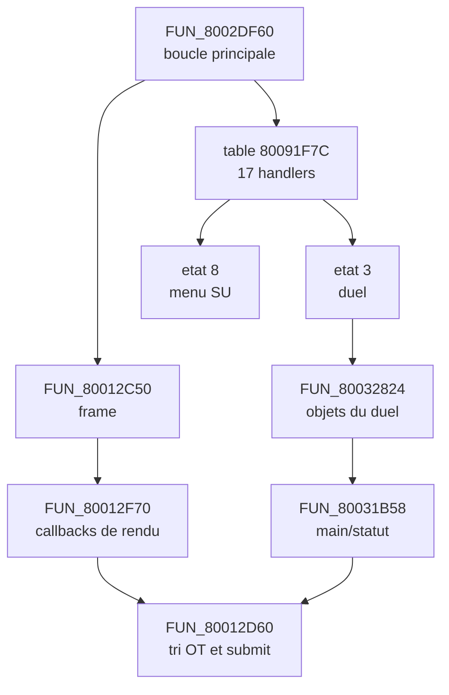

# Cartographie reverse engineering — B135.71

Branche analysee : `fix/b135-simon-gpf-quickstate`, commit `5ccba8b` (`B135.71: show and force live-hand finalizer gate`).

## Conclusion operationnelle

B135.71 ne remplace pas le rendu de la main. Les callbacks originaux construisent bien les paquets 52x60 et les inserent dans l'OT. Le contournement force uniquement `DAT_8009C4B8=1` a l'entree de `FUN_80012D60` lorsqu'une main vivante est detectee alors que le submit est ferme. L'equivalent original le plus probable et directement prouve par le pseudo-C est :

`FUN_80012F70 -> FUN_80015400 -> FUN_8001522C -> FUN_80015C18 -> DAT_8009C4B8=1`.

La priorite n'est donc pas de reecrire le duel, mais d'identifier pourquoi ce chemin original ne produit pas le bon etat au bon moment. Tant que cette cause n'est pas corrigee et testee sur 3DS, **B135.64, B135.66 et B135.71 doivent rester actifs**. Aucun changement de comportement runtime n'est inclus dans cette cartographie.

## Perimetre, methode et limites

Les sources, l'historique Git complet des commits B135, l'export Ghidra resident, les deux variantes de l'export SU et les analyses deja archivees ont ete croises. Le script `tools/build_reverse_map.py` regenere les index dans `research/reverse-map/`.

Resultats reproductibles :

| Element | Total | Nature |
|---|---:|---|
| Fonctions fusionnees | 1 582 | resident + seeds/overlay de la passe SU |
| Arcs directs distincts | 4 807 | `calls.tsv`, confiance statique |
| Entrees de la table d'etat principale | 17 | table `80091F7C` |
| Affectations de callbacks | 80 | pseudo-C, cible statique |
| Sites d'appel indirect encore ouverts | 92 | cible non inventee |
| Usages fonction/globale | 6 352 | index lecture/ecriture heuristique |

L'export resident seul contient 1 546 fonctions et 4 608 lignes d'appels, avec quatre echecs Ghidra (`80100000`, `8013B004`, `80140000`, `80146258`). La passe SU contient 1 582 fonctions et ne conserve qu'un echec a `80100000`.

Les deux variantes SU sont des snapshots synthetiques, pas des captures RAM en cours d'execution. Leurs tables fonctions/appels sont identiques. Leur unique divergence pseudo-C est `800418C0`, liee a la recuperation de `gp` par le decompilateur. Une adresse `0x801xxxxx` n'est donc jamais consideree comme une identite d'overlay a elle seule : cette fenetre est reutilisee.

Un « graphe complet » au sens des preuves disponibles est fourni par :

- `call_graph_enriched.tsv` : appels directs, table principale et callbacks affectes ;
- `indirect_calls.tsv` : les 92 sites restant a resoudre par dump de table ou trace `jalr` ;
- `functions_enriched.tsv` : origine et region de chaque fonction ;
- `global_usage.tsv` : index des globales par fonction et type d'acces ;
- `state_machines.json` : machines confirmees sous forme exploitable.

Il serait trompeur de pretendre resoudre les 92 cibles a partir des exports seuls. La prochaine acquisition necessaire est une trace runtime `(PC du jalr, cible, RA, identite/hash de l'overlay charge)`.

## Architecture d'execution reconstruite

### Dispatch principal

`FUN_8002DF60` appelle le service de frame, arme une fois le bit `0x80`, appelle `FUN_8002CF60`, puis execute `PTR_80091F7C[DAT_8009C60A & 0x1F]`. Il boucle tant que le bit `0x40` reste positionne ; a sa chute, il appelle `FUN_80015A1C`.

`DAT_8009C60A` combine donc index et drapeaux :

| Bits | Signification prouvee |
|---|---|
| `0x1F` | index de handler |
| `0x80` | pre-service de l'etat deja effectue |
| `0x40` | etat initialise/actif |
| `0x20` | variante locale utilisee par certains handlers |

| Etat | Handler | Identification | Confiance |
|---:|---|---|---|
| 0 | `8002CFDC` | scene residentielle pilotee par `800303EC`/`80031388` | structure confirmee, nom inconnu |
| 1 | `8002D354` | scene/resultat utilisant `8005622C`, `80056540`, `80056620` | moyenne |
| 2 | `8002D038` | VM de script `8002FCA4`, preparation `8002FF64` | haute |
| 3 | `8002D0BC` | duel | haute |
| 4 | `8002D2B4` | scene residentielle `8002C1AC`/`8002BC38` | nom inconnu |
| 5 | `8002D4AC` | overlay dynamique `8016866C`/`80168FCC` | identite inconnue |
| 6 | `8002D5CC` | overlay charge par `8003BCB4`, entree `80169024` | identite inconnue |
| 7 | `8002D544` | construction/attente d'objets de duel | haute pour la structure |
| 8 | `8002D75C` | menu SU | haute |
| 9 | `8002D800` | overlay `80168344`/`80169A1C` | identite inconnue |
| 10 | `8002D858` | overlay `80169E64`/`8016A160` | identite inconnue |
| 11 | `8002D89C` | overlay `801686AC`/`80168E1C` | identite inconnue |
| 12 | `8002D8F4` | transition puis retour possible vers SU | haute pour la transition |
| 13 | `8002D988` | handler vide | haute |
| 14 | `8002D990` | overlay `801820C0`/`80182408`/`80184210` | identite inconnue |
| 15 | `8002DBE0` | scene residentielle complexe | nom inconnu |
| 16 | `8002DE14` | ecran lie au duel/LP, overlay `80181050`/`80181408`/`80181F88` | moyenne |

`FUN_8002D62C(resultat_SU)` confirme les transitions : `0->2`, `2->16`, `3->14`, `4->11`, `5->2`, `6->6`, `8->4`, `9->10`; `7` appelle `80034190` puis sort du mode SU.

### Machine du duel

L'etat principal 3 utilise `DAT_8009C60B`. Le nibble bas est le sous-etat ; `0x80` est un latch d'entree.

| Sous-etat | Entree | Boucle | Sortie |
|---:|---|---|---|
| 0 | `80032824(PTR_FUN_80010000, 801D0200, 0, 0x80)` puis `8001591C` | attend `800340E8()==0` | nettoyage partiel, passe a 1 |
| 1 | `8001798C` | `80024444` | bit `0x2000` de `DAT_8009C582` -> 2 |
| 2 | — | nettoyage `80015A1C`, `80040258`, `80047F60`, etc. | restaure `DAT_8009C60A=DAT_8009C6FA` |

`FUN_80032824` construit les donnees des deux joueurs et leurs objets d'affichage. `FUN_80031B58`, affectee comme callback, dessine la main/le statut et appelle `FUN_80084978` pour les primitives de carte 52x60. Le chemin observe est :

`80032824 -> callback 80031B58 -> 80084978 -> OT de couche -> 80012D60 -> 80085D98 -> 80085D08`.

Les objets actifs qui rendent la miniature passent aussi par `80017E94 -> callback 80016C20 -> 800166A0 -> 800424B8(mode=1) -> 80084978`.

### Autres machines confirmees

- VM de scripts : dispatcher `8002FCA4`, opcode `DAT_8009C610`, identifiant/drapeaux `DAT_8009C628`, PC `DAT_8009C624`, override `DAT_8009C622`, table `80092068` indexee par `&0x1F`.
- VM dialogue : dispatcher `800393B8`, opcode `DAT_8009C6DA`, resultat `DAT_8009C6CC`, script imbrique `DAT_8009C6D2`, tables `80091F6C` et `80092270`.
- Pipeline frame : `80012C50 -> 80012F70 -> 80012CB8 -> 80012D60`.

## Globales d'etat prioritaires

| Globale | Role |
|---|---|
| `DAT_8009C60A` | etat principal + drapeaux |
| `DAT_8009C60B` | sous-etat du duel + latch d'entree |
| `DAT_8009C60C/60E` | contexte/resultat transmis au menu SU |
| `DAT_8009C60D` | etat de retour |
| `DAT_8009C6FA` | etat de retour apres duel |
| `DAT_8009C4B8` | gate de tri/submit OT (`0`, `1`, ou `0x80`) |
| `DAT_8009C414` | base du workspace du framebuffer courant |
| `DAT_8009C858..864` | quatre pointeurs `GsOT`; slot 1 a `C85C` |
| `DAT_800FF5C4` | allocateur de paquets GPU |
| `DAT_8009C332` | index framebuffer |
| `DAT_8009C6A0` | drapeaux de pipeline/transition |
| `DAT_800EB24C/24E` | progression et drapeaux du controleur de fade/submit |
| `DAT_8009C898[]`, `DAT_8009C450` | callbacks de rendu indirects |

La liste exhaustive des relations fonction/globale, y compris les globales non nommees, est dans `global_usage.tsv`. Le classement lecture/ecriture est une aide de navigation, pas une preuve de largeur de symbole : Ghidra fait se chevaucher plusieurs `DAT_` a la meme adresse.

## Chargement et identite des overlays

Le chargement SU est le seul overlay dont l'identite est fortement etablie :

`FUN_8006B560 -> FUN_80014D38(1, "M:\\mrgSU\\SU.mrg", DAT_8009C44B*0x88, 0x73, FUN_8006B350, 0, 0)`.

Le callback distribue 0x73 secteurs, soit `0x39800` octets :

| Etape | Taille | Destination | Role |
|---:|---:|---|---|
| 0 | `0x20000` | `DAT_8009C4B0` | donnees/VRAM mode 2 |
| 1 | `0x10000` | `DAT_8009C4B0` | donnees/VRAM mode 2 |
| 2 | `0x1000` | `801DD000` | donnees auxiliaires |
| 3 | `0x8000` | `PTR_DAT_8001002C = 80180000` | code overlay |
| 4 | `0x0800` | `801AF800` | donnees auxiliaires |

Identite fonctionnelle confirmee du menu SU : `8018001C` init, `80180390` update, `80180DA4` transition, `80180E48` destruction. `8018001C` installe notamment `LAB_80180B4C` dans `DAT_8009C898`.

Les candidats SU archives ont les SHA-256 suivants :

- variante 0, offset `0x31000` : `50cb0bc724960a22d586fc38fc6d49cfcf4884a341cff463edbb9850bada5a40` ;
- variante 1, offset `0x75000` : `afc3703f8a57196d54b6a15bd4a96679aef83ad7382c892d94fac11e809410f0`.

Les autres appels directs vers la fenetre overlay sont inventories mais leur identite reste volontairement ouverte : `80100000`, `80140000`, `80146258`, `80168254`, `801680F4`, `80168160`, `8013B004`, `8017B004`, `80180420`, `80180004`, `8018019C`, `8017A004`, `8016A850`, ainsi que les entrees listees dans la table des etats. Pour les nommer, il faut capturer le fichier MRG, l'offset de membre et un hash des octets presents au moment de l'appel.

## Appels indirects

Les familles principales encore ouvertes sont :

| Fonction | Source de la cible |
|---|---|
| `80012F70` | callbacks `DAT_8009C898[]` et `DAT_8009C450` |
| `8002DF60` | table d'etats `80091F7C` — ses 17 cibles sont resolues |
| `80030228` | table `800920C4` |
| `80031388` | tables `800921B0`/`800921C0` |
| `800340E8` | table `80092234` |
| `80038B4C` | table `800922B8` |
| `800393B8` | tables `80092068`/`80092270` |
| `8004110C` | callbacks d'objets |
| `80041FBC` | table `80092418` |

Les affectations statiques de callbacks ont ete ajoutees au graphe comme arêtes distinctes `callback_assignment`, jamais comme appels directs. Les 92 sites non resolus restent dans `indirect_calls.tsv` avec l'expression decompilee disponible.

## Cartographie des bridges B135

La version tabulaire exploitable est `bridge_map.tsv`. Synthese :

| Bridge | Pourquoi | Original remplace/contourne | Suppression | Correctif emulateur |
|---|---|---|---|---|
| B135.1-.6 | COP2/GTE incomplet | semantique GTE PS1 | non | finir les operations et transferts canoniques dans le coeur commun |
| B135.7-.8 | frame presentee au mauvais bord VSync | timing VSync/GP1 | non | modele GPU/VBlank et framebuffer coherent |
| B135.9-.13 | cout GPU/GTE | GP0/raster PS1 | fast paths sous equivalence seulement | implementation GPU exacte et tests pixels |
| B135.14-.28 | continuations chaudes mal couvertes | blocs residents/interpretes | pas avant test perf/timing | dispatch des entrees interieures, reentrant, quantum borne |
| B135.29-.47 | diagnostic puis fidelite GPU/presentation | DMA2, GP0, GP1 | probes oui ; correctifs non | unifier timing, frontbuffer et rasterisation exacte |
| B135.48 | preferer le tri original | `FUN_80085D98` | fallback non | rendre l'original fiable dans tous les contextes |
| B135.49-.63 | tracer la disparition de la main | aucune fonction | oui apres trace de reference | aucun, instrumentation |
| **B135.64** | premier tri de couche saute | premier `FUN_80085D98` de `80012D60` | **non** | corriger appel imbrique/reentrance et prouver un tri unique |
| B135.65 | compteurs d'entrees | aucune | oui | aucun |
| **B135.66** | appel ARM direct contourne le dispatch HLE | `FUN_80085D98` | **non** | frontiere d'appel generee correcte ou corps compile reentrant |
| B135.67-.70 | localiser la perte dans le finalizer | aucune | oui ; scans lourds deja desactives | aucun |
| **B135.71** | gate `C4B8` ferme avec OT main vivant | effet `8001522C -> 80015C18` | **non** | retablir appel, ordre et persistance de l'ecriture originale |

Point important : B135.71 inspecte jusqu'a 8 192 noeuds OT. C'est un detecteur de symptome robuste, pas une implementation originale. Le remplacer par un `C4B8=1` inconditionnel masquerait d'autres etats legitimes (`0`, `1`, `0x80`) et n'est pas acceptable.

Les bridges anterieurs a B135 (CD asynchrone/callbacks, DMA, IRQ/VBlank, pad, decodeur, transitions de menu, HLE de bibliotheque et pacing B131) peuvent aussi conditionner le duel. Ils ne sont pas attribues artificiellement a B135 ; leur audit doit preceder toute conclusion selon laquelle B135.71 serait la seule divergence restante.

## Plan de retrait sans casser le duel

1. Figer `5ccba8b` avec quick-state, capture ecran, compteurs B135.71 et hash du binaire comme oracle.
2. Ajouter une instrumentation **ponctuelle** aux entrees/sorties de `8001522C`, `80015C18` et `80015C28` : PC, RA, `C4B8` avant/apres, `EB24E`, parametres `[4],[5],[7]`. Aucun scan OT supplementaire.
3. Classer le defaut :
   - `80015C18` jamais appelee : callback/continuation/table ou couverture du recompileur ;
   - appelee sans ecriture persistante : store byte/adressage/memoire ;
   - appelee puis annulee : ordre/timing ou appel tardif de `80015C28` ;
   - appelee apres le finalizer : scheduling/frame boundary.
4. Corriger uniquement la couche fautive. Construire une variante ou **seule B135.71 est desactivee** ; rejouer le quick-state et verifier main, dialogues, fin de tour et retour menu.
5. Si stable, desactiver seulement B135.64 et verifier que les trois appels originaux a `80085D98` arrivent une fois et dans l'ordre.
6. Retirer les probes B135.49-.70 du hot path, sans toucher aux correctifs GPU/GTE.
7. En dernier, tester `FUN_80085D98` original sans B135.66 ni fallback C. Cela exige une trace des appels imbriques et un test de reentrance.

Chaque etape doit etre un commit autonome, avec un seul drapeau de comportement modifie et une procedure de retour immediate. Le critere de succes n'est pas seulement « la main apparait » : le duel complet B135.71, les transitions et le pacing doivent rester identiques.

## Verification effectuee ici

- integrite Git : `git fsck --full` sans erreur ;
- syntaxe du generateur : `python3 -m py_compile tools/build_reverse_map.py` ;
- regeneration deterministe des index ;
- conservation explicite des inconnues et des niveaux de confiance ;
- aucune modification de `3ds/source` ou du comportement runtime.

Une compilation 3DS et un test materiel ne sont pas possibles dans ce checkout : les fichiers ignores `work/upstream-psxrecomp` et la chaine devkitARM ne sont pas presents. Pour cette raison, la premiere instrumentation runtime proposee ci-dessus n'a pas ete appliquee sans preuve/verifiabilite.
