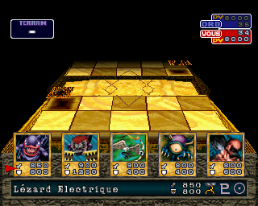

> [!NOTE]
> **Jalon historique PC.** Ce document décrit le runtime PC du 16 septembre 2026. Le chantier prioritaire est désormais le backend New 3DS natif ; voir [CURRENT_STATUS.md](CURRENT_STATUS.md), [ACTION_PLAN.md](ACTION_PLAN.md) et [WORK_HANDOFF.md](WORK_HANDOFF.md).

# Première partie et premières actions de duel sur PC

Validation du 16 septembre 2026, sur le runtime PC français construit dans ce
dépôt. Une nouvelle partie avec le nom de test AAA a été créée ; les dialogues
d'introduction ont été traversés jusqu'au choix Duel face à Simon Muran.


## Résultats observés

- Le clavier de nom accepte les lettres et le déplacement du curseur.
- Le nom est confirmé, le code du duelliste est annoncé et l'introduction
  affiche les personnages et les dialogues français.
- Le choix Duel conduit à la préparation des cartes, puis au plateau 3D.
- Le joueur reçoit cinq cartes ; les deux compteurs de vie affichent 8000.
- Une carte est sélectionnée, placée face cachée sur un emplacement du terrain,
  puis son étoile gardienne est confirmée.
- Start termine le tour : une carte apparaît côté adverse et une nouvelle main
  est présentée au joueur. Son compteur de pioche passe de 35 à 34.




Le duel n'a pas été terminé. Les dégâts, les fusions, les récompenses, l'audio,
la sauvegarde puis son rechargement restent à valider. La présence du code du
duelliste ne prouve pas à elle seule une sauvegarde fonctionnelle.

Le moteur PC conserve sa prise en charge du code dynamique : cette avancée
n'est pas la preuve d'un port intégralement natif ou d'une recompilation de tous
les overlays. Les compteurs de dispatch ne sont pas un pourcentage de couverture.

## Configuration et entrées

La révision du moteur reste `1965b2df424da03483a5370340433a862f78f103`.
Le scénario réussi utilise le scheduler HLE par défaut, le rendu logiciel,
le mode headless et une manette numérique déclarée explicitement :

```toml
[controller]
p1_mode="digital"
lock_mode=true
```

Les boutons injectés sont actifs à zéro : Start `0xFFF7`, Croix `0xBFFF`,
Rond `0xDFFF`, Droite `0xFFDF`. Les commandes TCP acceptées ne suffisent pas à
prouver une action : les captures et la réponse visuelle du jeu ont été vérifiées séparément.

## Incident d'intégrité du disque

Une copie de travail du BIN faisait 511336448 octets au lieu de 548427600.
Une nouvelle extraction depuis `disc.zip` a retrouvé l'empreinte attendue :
`9ef0d0ba5e42b838bd8312ecfe4071b09c44bc08ee896f6b76f913a41fe4b835`.
Avec cette copie et le scheduler d'origine, le scénario a été rejoué depuis le début jusqu'au duel.

`probe_pc_boot.py` refuse désormais un disque dont la taille ou le SHA-256 ne
correspond pas au BIN français connu.

## Rejouer et diagnostiquer

Le script accepte `--input-script`. La séquence des actions de cette session est dans
[inputs.json](../research/first-duel/inputs.json).

```sh
python tools/probe_pc_boot.py --runtime "<build>/fm-pc" --framework "<moteur>" --config "<game.toml avec controller digital>" --bios "<moteur>/bios/openbios.bin" --disc "<disque vérifié>/disc.cue" --output "work/replay-duel" --input-script research/first-duel/inputs.json
```

[evidence.json](../research/first-duel/evidence.json) contient les réponses du scénario vérifié, les empreintes des captures et les limites des vérifications. Les dumps RAM et données du jeu restent locaux.

## Portée actuelle de ce document

Ce document reste la référence fonctionnelle PC pour ce que le backend New 3DS devra reproduire : création d'une partie, introduction, entrée en duel, placement d'une carte et passage au tour adverse.
