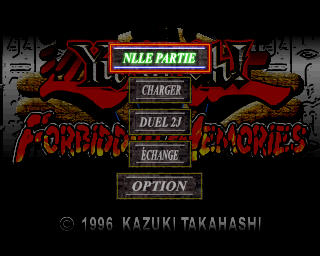

# Premier menu français obtenu sur PC

Le 15 septembre 2026, le runtime construit dans ce dépôt a affiché le logo
Konami, l'écran titre et le menu principal français. La capture finale montre
« Nlle partie », « Charger », « Duel 2J », « Échange » et « Option ».



## Ce qui a été exécuté

- Moteur psxrecomp : `1965b2df424da03483a5370340433a862f78f103`.
- Shards français : ceux du run `20260915T064032Z-586189fa`, 719 fonctions
  dans le périmètre résident expérimental.
- OpenBIOS recompilé, profil français PAL SLES-03948.
- Image BIN vérifiée : `9ef0d0ba5e42b838bd8312ecfe4071b09c44bc08ee896f6b76f913a41fe4b835`.
- Build Release avec `PSX_DEBUG_TOOLS=ON`, rendu logiciel, mode headless.
- Deux appuis Start via le contrôleur de diagnostic : masque actif bas
  `0xFFF7`, dix frames chacun, après les échantillons 2 et 5 (indices à partir de zéro).
- Aucun patch de mémoire du jeu, aucune modification des sources C générées.

Le scénario dure environ 43 secondes sur cette machine. Les appuis ont été
envoyés vers 18,3 et 33,4 secondes ; la capture finale du menu correspond à
environ 3669 frames mesurées par le moteur. Ces frames sont un compteur de
diagnostic, pas une mesure de fidélité ou de performances New 3DS.

## Interprétation des premiers écrans noirs

Le premier lancement sans diagnostic a été interrompu volontairement après
30 secondes : il n'avait pas quitté de lui-même. Les captures initiales noires
ne prouvaient pas un blocage permanent. Une trace ultérieure montre une attente
dans `8006A4D8`, qui appelle `80078B58` pour obtenir des données de flux vidéo.
Les lectures CD continuent. L'appui Start permet ensuite d'atteindre l'écran
titre, puis le menu. Cela ne valide pas encore la lecture complète des vidéos.

Les valeurs PC nulles de certaines requêtes pendant l'exécution ne doivent pas
être interprétées seules comme un crash : d'autres captures montrent des
adresses résidentes, une progression des frames et les écrans du jeu.

## Reproduire

Suivre [PC_RUNTIME_BUILD.md](PC_RUNTIME_BUILD.md), puis reconfigurer le même
répertoire de build avec `-DPSX_DEBUG_TOOLS=ON` et reconstruire `fm-pc`.
Depuis la racine du dépôt, adapter les chemins :

```sh
python tools/probe_pc_boot.py --runtime "<build>/fm-pc" --framework "<moteur>" --config "<run>/game.toml" --bios "<moteur>/bios/openbios.bin" --disc "<disque>/disc.cue" --output "work/probe-menu" --samples 8 --press-start --start-samples 2 5
```

Le répertoire output doit être nouveau. Il contient les requêtes/réponses JSON,
les captures, le journal et les fichiers utilisateur isolés de ce test.
Le script utilise le client TCP de la révision du moteur ; il n'attribue jamais
automatiquement un verdict visuel. Une capture refusée lorsque l'affichage
est encore désactivé reste enregistrée comme telle. Les commandes de capture
et les traces perturbent les performances ; ce scénario n'est pas un benchmark.

Le premier essai de trace utilisait incorrectement fntrace_arm sans cible.
Le script fourni corrige cet appel avec `target=0xFFFFFFFF` ; le scénario
du menu utilise cette version corrigée. Aucune conclusion ne repose sur
la trace vide des premiers essais.

## Limites et prochain jalon

Le menu est visible, mais la navigation, une nouvelle partie, les duels,
l'audio et les sauvegardes ne sont pas encore validés. Le runtime associe
code recompilé et prise en charge du code dynamique, notamment par
interprétation : ce résultat ne prouve pas que les overlays SU sont tous
recompilés. Il ne constitue pas encore un port natif New 3DS.

Prochain jalon : parcourir le menu, lancer une nouvelle partie puis atteindre
un premier duel, en capturant les overlays effectivement chargés. Cette base
servira ensuite à mesurer et remplacer les dépendances incompatibles New 3DS.

Les preuves machine du scénario réussi sont conservées dans
[evidence.json](../research/first-menu/evidence.json).
